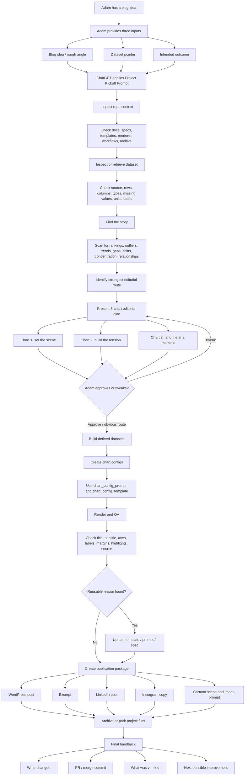

# Blog idea to publication process diagram

Use this diagram as the simple interaction model for starting a new coffeetableviz data story.

The key rule is: do not jump straight from dataset to chart config. Find the story first.

## Process diagram



## Simple prompt to start

```text
Use my Project Kickoff Prompt.

Blog idea:
[my rough idea / hunch]

Dataset:
[paste link, repo path, upload name, CSV source, Kaggle/OWID link]

Intended outcome:
[3-chart story only / chart configs / full blog package]
```

## Expected first response

```text
Recommended story route:
[best editorial angle]

Why this is the strongest route:
[short explanation grounded in the data]

3-chart story:
1. [Chart 1] — set the scene
2. [Chart 2] — build the tension
3. [Chart 3] — land the aha moment

Next build step:
[derived dataset / config / render / content package]
```

## Mental model

```text
Idea + dataset
-> inspect
-> find the story
-> present 3-chart plan
-> build charts
-> write post
-> publish package
-> archive
```
