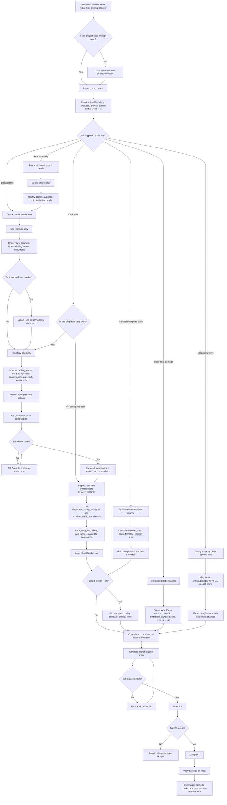

# coffeetableviz repo-aware production flow

This document shows the standard process for running a coffeetableviz data story through the `adamgreen1708/chart-templates` repo-aware workflow.

It is designed for ChatGPT-assisted production, where the assistant should inspect the repo, suggest better approaches, reduce manual copy/paste, create/update files where useful, QA outputs, and archive project-specific assets.

## Process flow diagram

## Operating principles

1. Inspect before changing files.
2. Use real data only.
3. Prefer direct GitHub file work when it saves Adam manual effort.
4. Keep active repo areas lean.
5. Do not leave reusable fixes trapped in one project config.
6. Do not jump from dataset inspection straight to chart config for blog/data-story work.
7. Present the strongest story route and 3-chart editorial plan before building configs.
8. Compare before PR and merge.
9. Verify after merge.
10. End with a clear summary and next suggested improvement.

## Key decision points

### Is this a one-off project change or a reusable improvement?

If the change improves only one chart, keep it in that chart config.

If it improves future charts, update the relevant template/control files:

- `spec/538_template_rules.md`
- `src/chart_config_template.py`
- `docs/chart_config_prompt.txt`
- `tests/test_538_rules.py`
- `AGENTS.md` if agent behaviour changes

### Does this need story discovery before config?

For blog/data-story work, yes.

Use `docs/story_discovery_and_3_chart_flow.md` before creating configs. The assistant should inspect the dataset, find the story, present the strongest options, recommend a 3-chart editorial plan, and only then build derived datasets and chart configs.

For a narrow config-only request, the assistant can proceed straight to `CHART_CONFIG` creation after inspecting the dataset.

### Does this belong in the active repo or archive?

Active repo:

- reusable renderer files;
- active chart config;
- active reusable workflows;
- process and template docs.

Archive:

- completed project data;
- one-off project scripts;
- one-off workflows;
- final outputs;
- blog/social project assets.

### What should ChatGPT hand back?

At the end of a repo task, ChatGPT should report:

- PR number and title;
- merge commit if merged;
- files changed;
- what was deliberately left untouched;
- checks performed;
- next sensible improvement.
